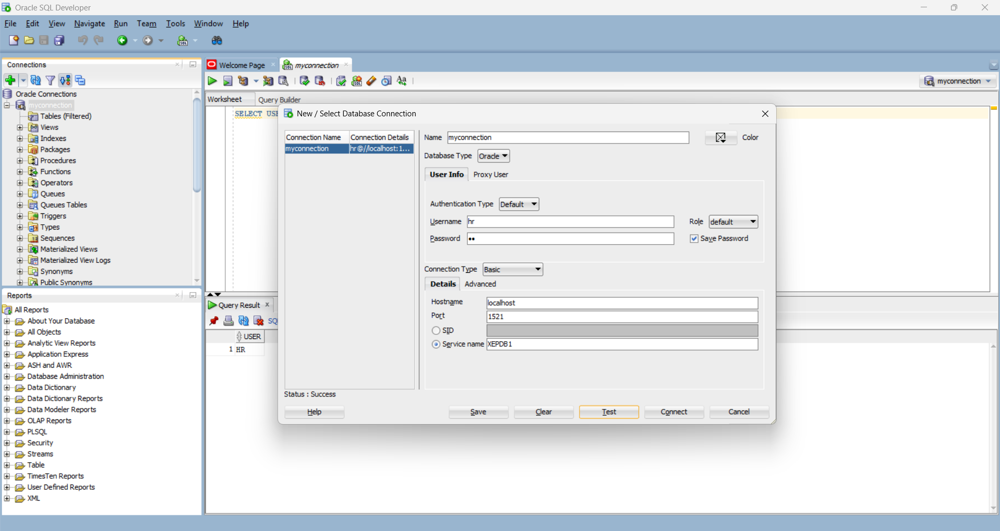
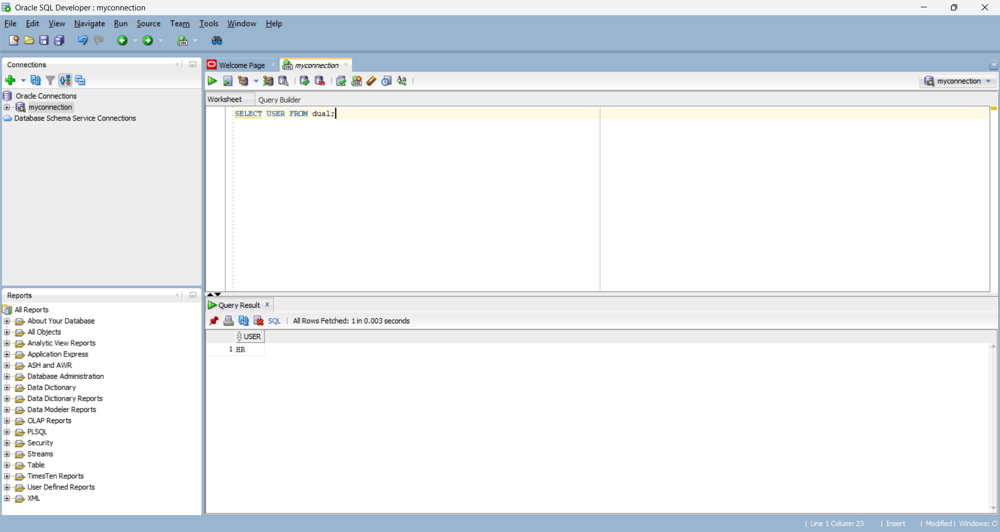

# Oracle 11g Introduction

## Assignment 1: SQL Developer Database Connection

### Objective
To create and test a database connection using Oracle SQL Developer.

### Connection Details

| Property | Value |
|---|---|
| Connection Name | myconnection |
| Username | hr |
| Password | hr |
| Hostname | localhost |
| Port | 1521 |
| Database | Oracle XE |
| Service Name | XEPDB1 |

### Connection Status

The database connection was successfully tested and connected using Oracle SQL Developer.

### Screenshots

#### Assignment Instructions

#### Successful Database Connection
